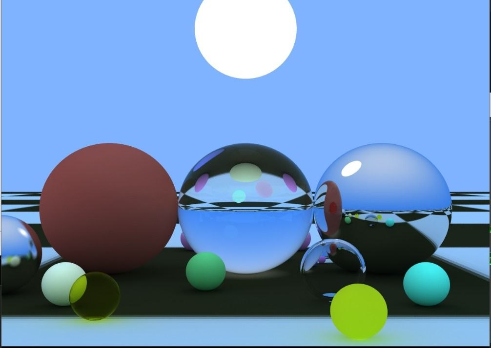
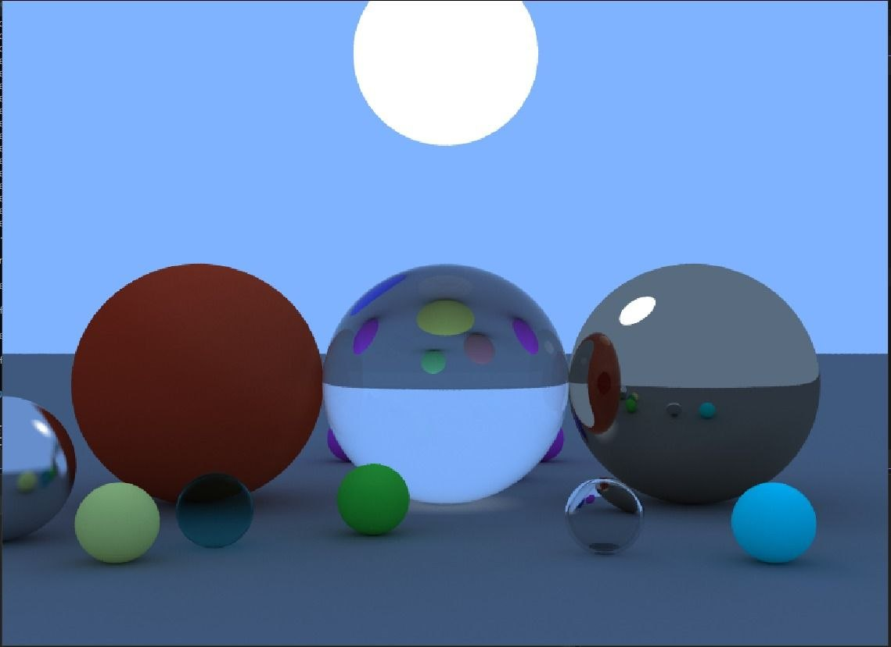

# CG Raytracer

A CPU-based path tracer written in C++23, rendering scenes in real time to an OpenGL texture via SDL3. It supports diffuse (Lambertian), metal, dielectric (glass), and emissive materials, with a KD-tree for accelerated ray-object intersection.

---

## Features

- **Path tracing** with configurable bounces and samples per pixel
- **Materials**
  - Diffuse (Lambertian) — random hemisphere scattering
  - Metal — specular reflection with roughness control
  - Dielectric — refraction with Snell's law and total internal reflection
  - Emissive — acts as a light source
- **KD-tree** acceleration structure for fast ray intersection
- **OBJ mesh loading**
- **Multi-threaded** rendering via `std::jthread`
- **Multiple scenes** — switch at runtime with `Tab`

---

## Requirements

### Windows
All dependencies are fetched automatically by CMake via `FetchContent`:
- SDL3 (fetched from GitHub)
- GLEW (fetched from GitHub)
- A C++23 capable compiler (MSVC 2022 or later recommended)
- CMake 3.20+

### Linux
Dependencies must be installed manually before building:
- SDL3
- GLEW
- OpenGL
- CMake 3.20+
- A C++23 capable compiler (GCC 13+ or Clang 16+)

Install on Ubuntu/Debian:
```bash
sudo apt install cmake libglew-dev libgl-dev
```

SDL3 is not yet in most package managers, so build it from source:
```bash
git clone https://github.com/libsdl-org/SDL.git
cd SDL
cmake -B build -DCMAKE_BUILD_TYPE=Release
cmake --build build
sudo cmake --install build
```

---

## Building

### Windows

```bash
git clone <repo-url>
cd CG_Raytracing
cmake -B build
cmake --build build --config Release
```

The executable will be in `build/Release/CG_Raytracing.exe`. Dependencies (SDL3.dll, glew.dll) are copied automatically.

### Linux

```bash
git clone <repo-url>
cd CG_Raytracing
cmake -B build -DCMAKE_BUILD_TYPE=Release
cmake --build build
```

The executable will be in `build/CG_Raytracing`.

---

## Running

### Windows
```bash
.\build\Release\CG_Raytracing.exe
```

### Linux
With X11
```bash
cd ./build/bin
./CG_Raytracing
```
With Wayland
```bash
cd ./build/bin
SDL_VIDEODRIVER=x11 ./CG_Raytracing
```

> The working directory must be the project root (or wherever the `assets/` folder is), as shaders and meshes are loaded from relative paths. CMake copies the `assets/` folder next to the executable automatically.

---

## Controls

| Key       | Action                              |
|-----------|-------------------------------------|
| `W`       | Rotate camera up                    |
| `S`       | Rotate camera down                  |
| `A`       | Rotate camera left                  |
| `D`       | Rotate camera right                 |
| `Tab`     | Switch between scenes               |

---

## Scenes

### Scene 1 — Main Scene
This scene showcases the different materials and features implemented. We have a bunch of spheres with different materials and colors and then there is the floor which is a mesh loaded from a .obj which is associated with a .mtl file for the material and a .jpg file for the texture.



### Scene 2 — Material Showcase
Similar to the previous one, but with a flat surface to better show how the different materials interact with light.



## Configuration

Render parameters are defined in `config.hpp`:

| Parameter          | Description                        |
|--------------------|------------------------------------|
| `IMAGE_WIDTH`      | Output image width in pixels       |
| `IMAGE_HEIGHT`     | Output image height in pixels      |
| `RAY_PER_PIXEL`    | Number of rays sampled per pixel   |
| `RENDER_ITERATION` | Number of render iterations        |
| `MAX_DEPTH`        | Maximum ray bounce depth           |
| `ASPECT_RATIO`     | Sensor aspect ratio                |
